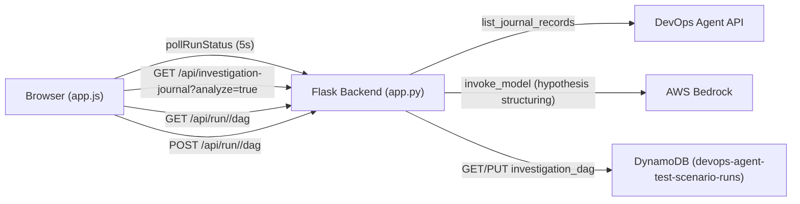
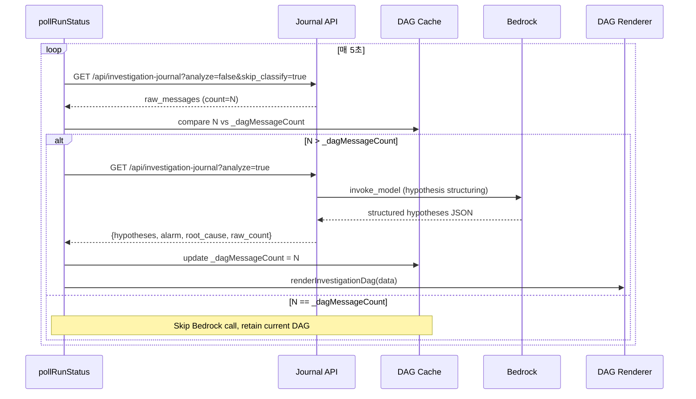
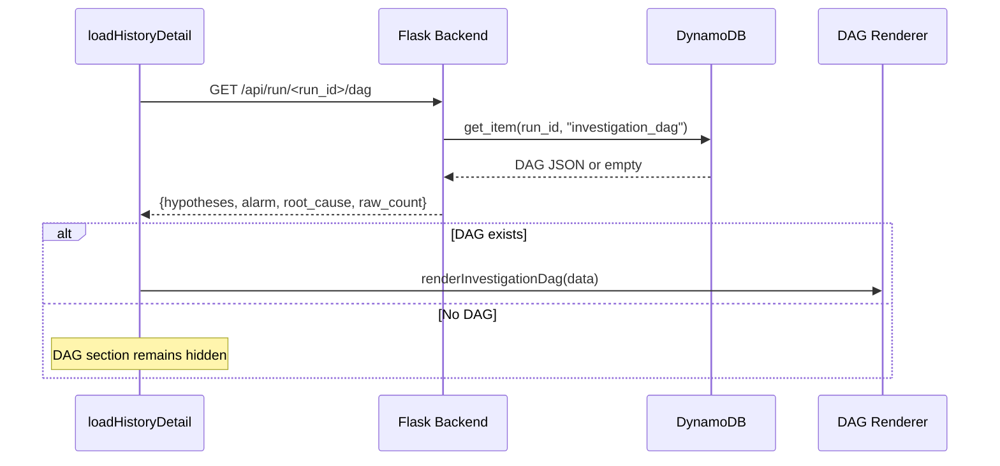

# Design Document: Realtime Investigation DAG

## Overview

DevOps Agent의 장애 조사 과정을 실시간 DAG(Directed Acyclic Graph)로 시각화하는 기능이다. 기존 `agentFlowSection` 아래에 `investigationDagSection`을 추가하여, 에이전트의 Triage → 가설 분기 → 검증 → 기각/확인 과정을 좌→우 방향 경로 그래프로 표현한다.

### Key Design Decisions

1. **순수 HTML/CSS 렌더링**: 외부 라이브러리 없이 HTML div + CSS flexbox로 DAG를 렌더링한다. 기존 `flow-node`, `flow-arrow` CSS 클래스 패턴을 재활용한다.
2. **기존 Bedrock 엔드포인트 재사용**: `/api/investigation-journal?analyze=true` 엔드포인트가 이미 가설 구조화 JSON을 반환하므로 새 엔드포인트 없이 재사용한다.
3. **메시지 카운트 기반 캐싱**: `window._dagMessageCount`로 마지막 Bedrock 호출 시점의 메시지 수를 추적하여, 변경이 없으면 API 호출을 건너뛴다.
4. **DynamoDB 저장/조회**: 조사 완료 시 최종 DAG를 `record_type="investigation_dag"`로 저장하고, 이력 조회 시 GET `/api/run/<run_id>/dag`로 읽는다.
5. **텍스트 + 색상만 사용**: 아이콘/이모지 없이 텍스트와 색상(Red=#ef4444 기각, Green=#22c55e 확인, Yellow=#f59e0b 진행중)으로 상태를 표현한다.

## Architecture

### System Context



### Data Flow (실시간 모드)



### Data Flow (이력 조회 모드)



## Components and Interfaces

### Frontend Components

#### 1. `investigationDagSection` (HTML)
- `agentFlowSection` div 아래에 배치되는 새 섹션
- 초기 상태: `display:none`
- 섹션 헤더: "조사 흐름 DAG" (텍스트만, 이모지 없음)

#### 2. `renderInvestigationDag(data)` (JavaScript)
- **Input**: Hypothesis Structurer 응답 JSON (`{hypotheses, alarm, root_cause, raw_count}`)
- **Output**: `investigationDagSection` 내부에 DAG HTML 렌더링
- **Process**:
  1. 응답 JSON을 파싱하여 DAG_Node/DAG_Edge 리스트 생성 (`parseHypothesesToDag`)
  2. DAG_Node를 좌→우 flexbox 레이아웃으로 렌더링
  3. DAG_Edge를 `flow-arrow` 스타일 커넥터로 렌더링
  4. 상태별 색상 적용 (rejected=red, confirmed=green, partial=yellow)

#### 3. `parseHypothesesToDag(data)` (JavaScript)
- **Input**: `{hypotheses, alarm, root_cause}`
- **Output**: `{nodes: DAG_Node[], edges: DAG_Edge[]}`
- **Process**:
  1. Triage 루트 노드 생성 (alarm 텍스트)
  2. 각 hypothesis → branch 노드 + step 노드들 생성
  3. 확인된 가설 → Root Cause 터미널 노드 생성
  4. 기각된 가설 → "기각" 터미널 노드 생성
  5. `leads_to` 필드가 있으면 cross-branch 엣지 생성

#### 4. DAG Cache (`window._dagMessageCount`, `window._dagData`)
- `_dagMessageCount`: 마지막 Bedrock 호출 시점의 raw_messages 수
- `_dagData`: 마지막 Bedrock 응답 데이터 (재렌더링용)
- 새 run 시작 시 둘 다 리셋

### Backend Components

#### 5. `GET /api/run/<run_id>/dag` (Flask route)
- DynamoDB에서 `run_id` + `record_type="investigation_dag"` 조회
- 없으면 404 반환
- 있으면 저장된 DAG JSON 반환

#### 6. `POST /api/run/<run_id>/dag` (Flask route)
- Request body: `{hypotheses, alarm, root_cause, raw_count}`
- DynamoDB에 `run_id` + `record_type="investigation_dag"`로 저장
- `scenario_id` 필드도 함께 저장

### Interface Contracts

```
GET /api/run/<run_id>/dag
Response 200: {
  "hypotheses": [...],
  "alarm": "string",
  "root_cause": {...},
  "raw_count": number
}
Response 404: {"error": "DAG not found"}

POST /api/run/<run_id>/dag
Request: {
  "hypotheses": [...],
  "alarm": "string",
  "root_cause": {...},
  "raw_count": number,
  "scenario_id": "string"
}
Response 200: {"success": true}
Response 500: {"error": "string"}
```

## Data Models

### DAG_Node

```typescript
interface DAGNode {
  id: string;           // "triage" | "hyp-{i}" | "hyp-{i}-step-{j}" | "hyp-{i}-result" | "root-cause"
  label: string;        // 노드 주 텍스트 (action 또는 title)
  sublabel: string;     // 보조 텍스트 (data_source 또는 status_reason)
  type: "triage" | "hypothesis" | "step" | "result";
  color: string;        // "#ef4444" | "#22c55e" | "#f59e0b" | "#94a3b8"
  branch_index: number; // 가설 분기 인덱스 (triage=0)
  is_key: boolean;      // 핵심 발견 여부 (step 노드만)
}
```

### DAG_Edge

```typescript
interface DAGEdge {
  from_id: string;  // source DAG_Node.id
  to_id: string;    // target DAG_Node.id
}
```

### DynamoDB Record (investigation_dag)

```json
{
  "run_id": "abc12345",
  "record_type": "investigation_dag",
  "scenario_id": "C01-redis",
  "hypotheses": [...],
  "alarm": "알람 요약 텍스트",
  "root_cause": {
    "summary": "근본 원인 요약",
    "matched": true
  },
  "raw_count": 15
}
```

### Hypothesis Structurer Response (기존 `/api/investigation-journal?analyze=true`)

이미 존재하는 응답 형식을 그대로 사용:

```json
{
  "ok": true,
  "hypotheses": [
    {
      "id": 1,
      "title": "가설 제목",
      "category": "코드변경|서비스장애|인프라|데이터|설정",
      "status": "rejected|partial|confirmed",
      "status_reason": "기각/확인 이유",
      "leads_to": null,
      "steps": [
        {
          "action": "조사 행동",
          "data_source": "메트릭|로그|트레이스|K8s|코드|배포이력",
          "insight": "발견 인사이트",
          "is_key": false,
          "source_times": ["HH:MM"]
        }
      ]
    }
  ],
  "alarm": "알람 요약",
  "root_cause": { "summary": "...", "matched": true },
  "raw_count": 15
}
```

## Correctness Properties

*A property is a characteristic or behavior that should hold true across all valid executions of a system — essentially, a formal statement about what the system should do. Properties serve as the bridge between human-readable specifications and machine-verifiable correctness guarantees.*

### Property 1: Triage root node invariant

*For any* valid Hypothesis Structurer response containing at least one hypothesis, the parsed DAG SHALL always contain exactly one node with `type="triage"` and it SHALL be the root node (no incoming edges) positioned at `branch_index=0`.

**Validates: Requirements 2.2**

### Property 2: Structural preservation (hypothesis count, step count, status)

*For any* valid Hypothesis Structurer response with N hypotheses where hypothesis i has S_i steps, the parsed DAG SHALL contain exactly N distinct `branch_index` values (excluding triage), exactly S_i nodes of `type="step"` for each branch i, and the status of each hypothesis SHALL be preserved in the color assignment of its branch nodes. This subsumes round-trip structural integrity.

**Validates: Requirements 2.3, 3.1, 3.5, 8.4**

### Property 3: Status-to-color mapping consistency

*For any* hypothesis in the parsed DAG, all nodes belonging to that hypothesis branch SHALL have the same color determined by the hypothesis status: `#ef4444` for "rejected", `#22c55e` for "confirmed", and `#f59e0b` for "partial". No other color values SHALL appear for hypothesis branch nodes.

**Validates: Requirements 3.2, 3.3, 3.4**

### Property 4: Node fields faithfully represent source data

*For any* step in a hypothesis, the corresponding DAG_Node SHALL have `label` equal to the step's `action` text, `sublabel` equal to the step's `data_source`, and `is_key` equal to the step's `is_key` value.

**Validates: Requirements 4.1, 4.2, 4.4**

### Property 5: Well-formed DAG output

*For any* valid Hypothesis Structurer response, every parsed DAG_Node SHALL have all required fields (`id`, `label`, `sublabel`, `type`, `color`, `branch_index`), every DAG_Edge SHALL reference existing node IDs in both `from_id` and `to_id`, and sequential nodes within each branch SHALL be connected by exactly one edge.

**Validates: Requirements 8.1, 8.2**

### Property 6: Cross-branch edges from leads_to

*For any* hypothesis with a non-null `leads_to` field referencing hypothesis ID X, the parsed DAG SHALL contain an edge from the source hypothesis's result node to hypothesis X's hypothesis node.

**Validates: Requirements 8.3**

### Property 7: Cache comparison correctness

*For any* pair of (stored_count, new_count) where both are non-negative integers, the cache logic SHALL return "skip" (no API call) when `new_count == stored_count`, and "call" (trigger API) when `new_count != stored_count`.

**Validates: Requirements 5.2, 6.2, 6.3, 6.4**

### Property 8: DAG save/load round-trip

*For any* valid DAG structure containing `hypotheses`, `alarm`, `root_cause`, and `raw_count` fields, saving to DynamoDB via POST and loading via GET SHALL return a structure where all four fields are present and equivalent to the original.

**Validates: Requirements 7.5**

## Error Handling

| Error Scenario | Handling Strategy |
|---|---|
| Bedrock API 호출 실패 | 이전 DAG 유지, DAG 섹션 하단에 "분석 업데이트 실패" 텍스트 표시 (non-blocking) |
| Journal API 호출 실패 | DAG 업데이트 건너뜀, 다음 폴링 주기에 재시도 |
| DynamoDB DAG 저장 실패 | 콘솔 로그 출력, 사용자에게는 영향 없음 (실시간 DAG는 프론트엔드에 이미 렌더링됨) |
| DynamoDB DAG 조회 실패 (GET) | 404 반환, 프론트엔드에서 DAG 섹션 숨김 |
| 가설 응답 JSON 파싱 실패 | 이전 DAG 유지, 에러 로그 출력 |
| 빈 hypotheses 배열 | DAG 섹션 숨김 유지 |
| leads_to가 존재하지 않는 hypothesis ID 참조 | 해당 cross-branch 엣지 무시, 나머지 DAG 정상 렌더링 |

## Testing Strategy

### Unit Tests (Example-based)

- DOM 배치: `investigationDagSection`이 `agentFlowSection` 뒤에 존재하는지 확인
- 초기 상태: 데이터 없을 때 `display:none` 확인
- 섹션 헤더: 데이터 있을 때 "조사 흐름 DAG" 텍스트 확인
- 캐시 리셋: 새 run 시작 시 `_dagMessageCount = 0` 확인
- 에러 처리: API 에러 시 이전 DAG 유지 확인
- 진행 중 표시: 활성 조사 시 "진행 중..." 노드 존재 확인
- 이력 조회: DAG 없는 run 로드 시 섹션 숨김 확인

### Property Tests (Property-based)

Property-based testing library: **fast-check** (JavaScript)

각 property test는 최소 100회 반복 실행하며, 랜덤 생성된 hypothesis 구조 데이터로 `parseHypothesesToDag` 함수의 정확성을 검증한다.

- **Property 1**: 랜덤 hypothesis 데이터 → triage 노드 존재 및 유일성 검증
  - Tag: `Feature: realtime-investigation-dag, Property 1: Triage root node invariant`
- **Property 2**: 랜덤 N개 hypothesis (각각 랜덤 step 수) → branch 수, step 수, status 보존 검증
  - Tag: `Feature: realtime-investigation-dag, Property 2: Structural preservation`
- **Property 3**: 랜덤 status 값 → 색상 매핑 일관성 검증
  - Tag: `Feature: realtime-investigation-dag, Property 3: Status-to-color mapping consistency`
- **Property 4**: 랜덤 step 데이터 → label, sublabel, is_key 필드 일치 검증
  - Tag: `Feature: realtime-investigation-dag, Property 4: Node fields faithfully represent source data`
- **Property 5**: 랜덤 hypothesis 데이터 → 모든 노드 필드 존재, 엣지 유효성 검증
  - Tag: `Feature: realtime-investigation-dag, Property 5: Well-formed DAG output`
- **Property 6**: 랜덤 leads_to 참조 → cross-branch 엣지 존재 검증
  - Tag: `Feature: realtime-investigation-dag, Property 6: Cross-branch edges from leads_to`
- **Property 7**: 랜덤 (old_count, new_count) 쌍 → 캐시 비교 결과 검증
  - Tag: `Feature: realtime-investigation-dag, Property 7: Cache comparison correctness`
- **Property 8**: 랜덤 DAG 데이터 → POST 저장 후 GET 조회 시 필드 보존 검증 (mock DynamoDB)
  - Tag: `Feature: realtime-investigation-dag, Property 8: DAG save/load round-trip`

### Integration Tests

- 실시간 폴링: `pollRunStatus` → journal API → Bedrock → DAG 렌더링 전체 흐름
- DynamoDB 저장/조회: 실제 DynamoDB 테이블에 DAG 저장 후 조회
- 이력 로드: `loadHistoryDetail` → GET `/api/run/<run_id>/dag` → DAG 렌더링

